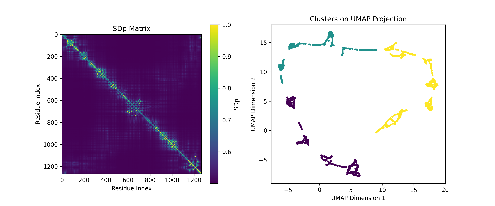
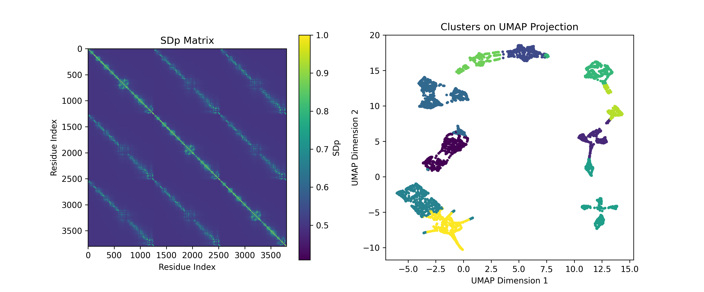

# RBPseg: A Tool for Tail Fiber Structure Prediction

**RBPseg** is a pipeline designed to predict and analyze phage tail fiber proteins. It has three major modules. First, it uses structural information (ESMfold/ColabFold/Alphafold) monomeric prediction to find pseudo-domains in the fiber and fractionate its sequence to '.FASTA' files (using the sDp approach) that can be further predicted using AlphaFold-multimer as trimers. The fraction modules can be merged together into a full fiber structure. RBPseg also has a built structural clustering metric (SM/pSM) that estimate the optimal number of clusters giving a TM-score matrix. 

## Installation

To get started with `RBPseg`, follow the steps below.

### Requirements

- Python 3.8+
- Conda 
- CUDA-enabled GPU (optional for faster computations)


Clone this repository to your local machine:
```bash
git clone https://github.com/VKleinSousa/rbpseg.git
cd rbpseg
```

```bash
conda create -n rbpseg_env python=3.10
conda activate rbpseg_env
```

Install RBPseg using pip:

```bash
pip install .
```

Conda install the remaining dependencies

```
conda install -c conda-forge pdbfixer openmm
```


Optionally, verify that the installation was successful by running:

```bash
rbpseg-sdp --help
```


### Usage

Once installed, you can run RBPseg from the command line to perform structural segmentation and merging.

The main entry points are rbpseg-sdp for domain segmentation and rbpseg-merge for merging chains.
Basic Command

```bash
rbpseg-sdp -p <pdb_file> -s <min_domain_size> -pd <pair_distance_constant>
```


## Examples
#### Example 1: Creating fraction fastas using an ESMfold model

To run the segmentation on a PDB file:

```bash
rbpseg-sdp -p Examples/Example1-sDp/rbp_11.pdb -c HDBSCAN -so -np 
```

outputs: FASTA files; overlaps file; sDp plot:



#### Example 2: Merging fractions

To run the merge process:

```bash
rbpseg-merge -d Examples/Example2-Merge -of Examples/Example2-Merge/overlaps.csv -n rbp_11.pdb
```
outputs: merged file (rbp_11.pdb). 

Add ```-r ``` to run relaxation. The relaxation step needs CUDA to run. You can skip relaxation by adding the flag ``` -r False ```

#### Example 3: Finding pseudo-domains

```bash
rbpseg-sdp -p Examples/Example3-PseudoDomain/rbp_11.pdb -k 20 -sv
```




## Reference ##

If you applied any of these codes in your work, please consider citing:

***Towards a complete phage tail fiber structure atlas.
Victor Klein-Sousa, Aritz Roa-Eguiara, Claudia Sybille Kielkopf, Nicholas Sofos, Nicholas M. I. Taylor
bioRxiv 2024.10.28.620165; doi: https://doi.org/10.1101/2024.10.28.620165***

```
@article {Klein-Sousa2024.10.28.620165,
	author = {Klein-Sousa, Victor and Roa-Eguiara, Aritz and Kielkopf, Claudia Sybille and Sofos, Nicholas and Taylor, Nicholas M. I.},
	title = {Towards a complete phage tail fiber structure atlas.},
	elocation-id = {2024.10.28.620165},
	year = {2024},
	doi = {10.1101/2024.10.28.620165},
	publisher = {Cold Spring Harbor Laboratory},
	abstract = {Bacteriophages use receptor-binding proteins (RBPs) to adhere to bacterial hosts. Understanding the structure of these RBPs can provide insights into their target interactions. Tail fibers, a prominent type of RBP, are typically elongated, flexible, and trimeric proteins, making it challenging to obtain high-resolution experimental data of their full-length structures. Recent advancements in deep learning-based protein structure prediction, such as AlphaFold2-multimer (AF2M) and ESMfold, allow for the generation of high-confidence predicted models of complete tail fibers. In this paper, we introduce RBPseg, a method that combines monomeric ESMfold predictions with a novel sigmoid distance pair (sDp) protein segmentation technique. This method segments the tail fiber sequences into smaller fractions, preserving domain boundaries. These segments are then predicted in parallel using AF2M and assembled into a full fiber model. We demonstrate that RBPseg significantly improves AF2M v2.3.2 in terms of model confidence, running time, and memory usage. To validate our approach, we used single-particle cryo-electron microscopy to analyze five tail fibers from three phages of the BASEL collection. Additionally, we conducted a structural classification of 67 fibers and their domains, which identified 16 well-defined tail fiber classes and 89 domains. Our findings suggest the existence of modular fibers as well as fibers with different sequences and shared structure, indicating possible sequence convergence, divergence, and domain swapping. We further demonstrate that these structural classes account for at least 24\% of the known tail fiber universe.Competing Interest StatementThe authors have declared no competing interest.},
	URL = {https://www.biorxiv.org/content/early/2024/10/28/2024.10.28.620165},
	eprint = {https://www.biorxiv.org/content/early/2024/10/28/2024.10.28.620165.full.pdf},
	journal = {bioRxiv}
}

```


